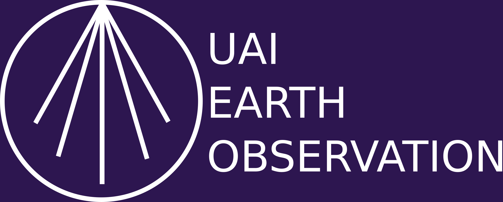
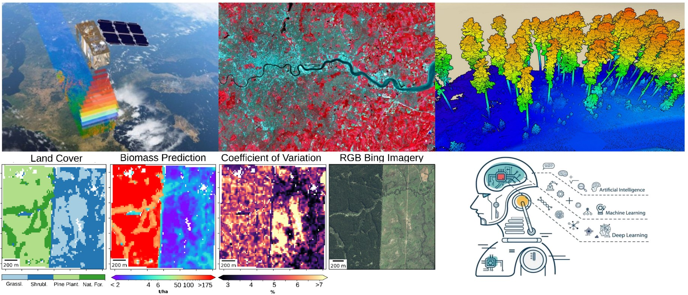

# UAI-Teledeteccion-Aplicada

**_Curso electivo del programa de Master in Science of Data Science (MSDS), Universidad Adolfo Ibáñez, Chile_**

| |
|-|
|  |

## DESCRIPCIÓN DE LA ASIGNATURA

Los sistemas terrestres naturales y antropogénicos son espacialmente complejos y cambiar sus características y estructura constantemente en el tiempo. La percepción remota, o teledetección, permiten el monitoreo constante de la superficie terrestre de forma objetiva y costo-eficiente. Esto es fundamental para la toma informada de decisiones a escala territorial. En este curso se discutirán las principales características, tipos y aplicaciones de sensores remotos, desde datos tomados por drones a satélites. Se discutirá los principios físicos de la teledetección ambiental, ejemplificando las ventajas, desventajas y procesamiento de los distintos tipos de datos: ópticos, LiDAR y RADAR, y cómo estos se utilizan en el modelamiento espacial mediante algoritmos de Machine Learning. Finalmente, el curso tiene un enfoque práctico, por lo que se utilizarán prácticos de manejo y análisis de datos en con-
junto a las clases teóricas. Se elaborará un trabajo de investigación de formato libre al final del curso.

## BREVE BIOGRAFÍA DEL PROFESOR

Javier Lopatin se integró a la Facultad de Ingeniería y Ciencias UAI en marzo de 2021. Es es ingeniero en Recursos Naturales Renovables de la U. Chile y Dr. en Recursos Naturales del Instituto Tecnológico de Karlsruhe (KIT), Alemania. Sus áreas de investigación se centran en la ecología del paisaje y la ecología de ecosistemas,
utilizando datos obtenidos por teledetección de satélite y drones. Algunos de sus temas de investigación incluyen las estimaciones de biodiversidad, propiedades y funciones ecositémicas como la biomasa y el carbono subterráneo, composición florística de las comunidades vegetales, detección de especies invasoras, incendios, y cambios de uso de suelo, entre otras, utilizando métodos de Machine y Deep learning.

## COMPETENCIAS DEL PERFIL DE EGRESO QUE SE DESARROLLAN EN EL CURSO

- **Pensamiento crítico y creativo**: Este curso busca desarrollar competencias para el análisis, evaluación y resolución de desafíos asociados a la percepción remota en sistemas terrestres a través de metodologías innovadoras y basadas en evidencia.

- **Ingeniería de vanguardia**: Este curso permitirá que los estudiantes conozcan y apliquen algunas herramientas científicas y tecnológicas asociadas a la observación de procesos terrestres.

## OBJETIVOS ESPECÍFICOS DEL CURSO

- Discutir las propiedades físicas de la teledetección ambiental.
- Discutir los tipo de sensores remotos y sus características.
- Explorar como estos datos se utilizan para modelar propiedades del territorio.
- Conocer y aplicar técnicas de percepción remota en sistemas terrestres.

## RESULTADOS DE APRENDIZAJE

Luego de realizar el curso los alumnos serán capaces de:

- Explicar las bases físicas de los procesos de teledetección ambiental.
- Definir las principales características de los tipos de sensores remotos.
- Describir posibles áreas de aplicación de datos de teledetección.
- Obtener y analizar datos de plataformas de percepción remota en sistemas terrestres.
- Explicar fenómenos biológicos a través del análisis de datos de percepción remota en sistemas terrestres.

## ESTRATEGIAS DE ENSEÑANZA Y APRENDIZAJE

El curso constará de clases lectivas, lectura de artículos científicos, desarrollo de guías/tareas/controles, laboratorios (presenciales y/o virtuales) y de la realización de un proyecto de investigación grupal y práctico por parte de los estudiantes.

## PROCEDIMIENTOS DE EVALUACIÓN DE APRENDIZAJES

- 4 controles teóricos individuales (30%)
- 2 trabajos individuales de investigación (25%)
- Un trabajo de investigación final grupal con tema a elección (25%)
- Presentación grupal sobre tema en clases (10%)
- Presentación grupal del trabajo final (10%)

## UNIDADES

- **Propiedades físicas de la intelección ambiental**\
    Introducción a la teledetección ambiental\
    Propiedades físicas de la luz y el espectro electromagnético\
    Tipos de sensores remotos y tecnologías\
    Calibraciones radiométricas, topográficas, y atmosféricas\
    Índices vegetacionales y otros proxies de fitness\
    Laboratorios aplicados

- **Fotogrametría con Drones**\
    Principios de la fotogrametría\
    Normas vigentes en Chile\
    Structure-from-Motion (SfM)\
    Planificación de vuelos y procesamiento de imágenes\
    Laboratorios aplicados

- **Sensores activos: LiDAR y RADAR**\
    Tecnologías LiDAR y RADAR\
    Tipos de sensores\
    Procesamiento de datos LiDAR y RADARLaboratorios aplicados

- **Modelamiento predictivo**\
    Introducción a modelos predictivos espaciales: clasificaciones y regresiones\
    Autocorrelación espacial y temporal\
    Obtención de datos de entrenamiento y validación \
    Serie temporal de datos

## HABILIDADES ABET
Habilidad para desarrollar y conducir experimentos apropiados, analizar e interpretar datos, y obtener conclusiones basadas en juicios ingenieriles (6.1 y 6.3)

## ODS
Se abordará el ODS 15 (vida de ecosistemas terrestres), a nivel de Competencias, es decir, los estudiantes podrán poner en acción sus conocimientos para modificar la realidad en el contexto del ODS

## REGLAMENTO
El curso se regirá por el reglamento vigente para las asignaturas de quinto año y magíster de la Universidad y por el reglamento del Código de Honor, en cuanto a los aspectos de ética, honestidad, respeto a las personas y sus bienes, contribución y cuidado. Los documentos se encuentran disponibles en https://alumnosfic.uai.cl/quinto-ano/reglamentos/.
